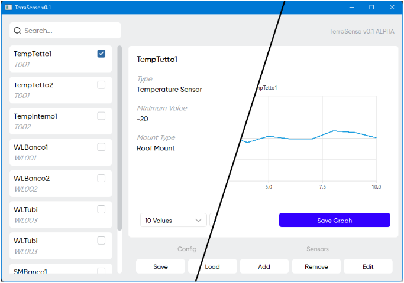

# TerraSense

<div align="center">
  
  
</div>

<p align="center">
  <em>Una piattaforma completa per la gestione e simulazione di sensori in serra</em>
</p>




## Panoramica

TerraSense è un'applicazione basata su Qt progettata per la gestione e simulazione di sensori all'interno di una serra. La piattaforma fornisce un'interfaccia intuitiva per aggiungere, modificare, cancellare e cercare sensori, offrendo al contempo capacità di simulare dati attraverso diverse distribuzioni statistiche.

Sviluppata per il corso di "Programmazione ad Oggetti" (PaO). Università di Padova, 2023/24.

## Alcune funzionalità implementate 

- **Campi specifici**: Parametri unici per ogni tipologia di sensore.
- **Ricerca in tempo reale**: Ricerca case-sensitive con supporto a RegEx e pattern-matching.
- **Distribuzioni multiple**: Generatore di dati casuale, gaussiano e logaritmico.
- **Capacità di esportazione grafici**: Salva i grafici come immagini PNG.
- **Persistenza dati in formato JSON**: Salva e carica configurazioni e tutti i parametri dei sensori.
- **UI di design**: Interfaccia grafica sviluppata e graficamente efficace. Ottimizzata per dispositivi touchscreen.
- **Singola Finestra**: Tutte le funzionalità implementate in un unica finestra.
- **Scorciatoie da tastiera**

## Installazione

### Prerequisiti
- Qt Framework
- Compilatore compatibile C++17

### Guida

1. Clona il repository:
   ```bash
   git clone https://github.com/tuo-username/terrasense.git
   cd terrasense
   ```

2. Compila il progetto:
   ```bash
   qmake TerraSense.pro
   make
   ```

3. Esegui l'applicazione:
   ```bash
   //Non ricordo dove salva la release, trova il file eseguibile ed esegui
   ./TerraSense
   ```

## Ulteriori informazioni
Altre informazioni vengono fornite all'interno del documento "DocumentoDiSpecifiche.pdf".

È stato caricato il commit di consegna, testato e funzionato nella macchina virtuale fornita dal professore. Come indicato nel documento di specifiche, sono state applicate modifiche di retrocompatibilità in quanto la versione del framework Qt differiva dall'ultima disponibile.

Viene caricata anche la valutazione con il commento del professore, a scopo informativo, in spirito di trasparenza e buona fede.